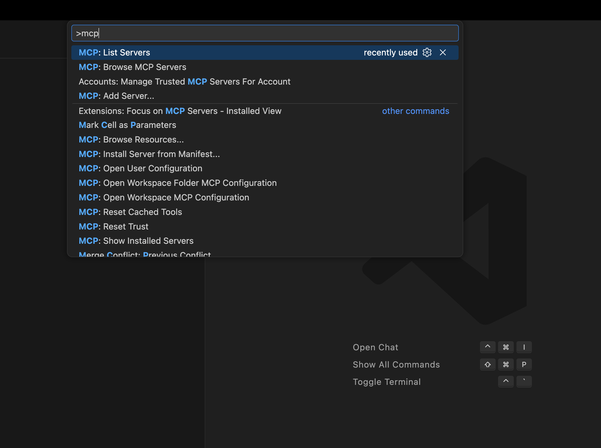
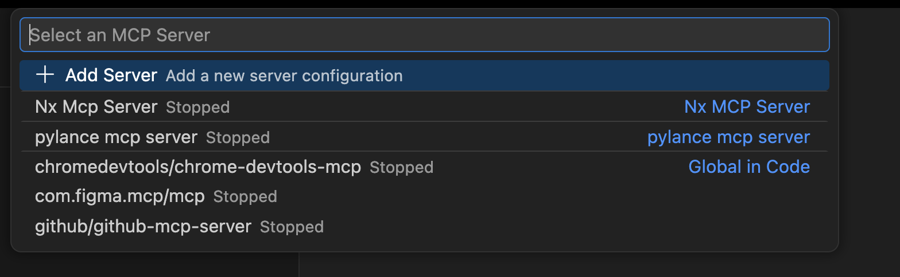
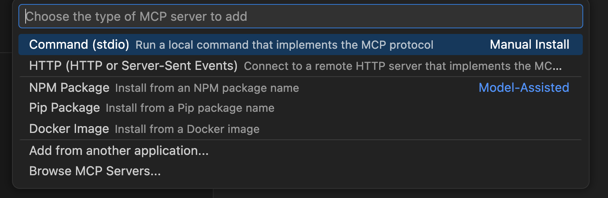
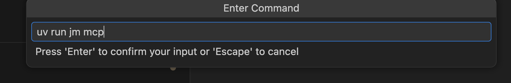
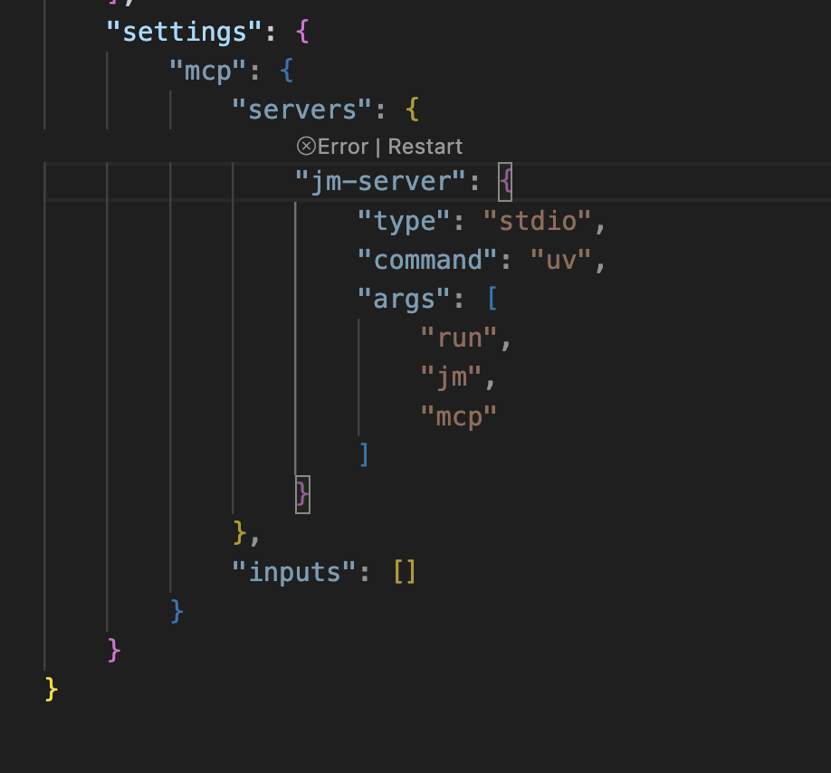

# MCP + VSCode Setup

This guide explains how to connect VSCode to the Jean-Michel MCP server.

## Prerequisites

- `jean-michel` installed in your target project (PyPI or editable)
- `uv` available on your machine
- VSCode MCP support enabled

## 1. Open MCP Servers in VSCode

Open the MCP server picker in VSCode.



## 2. Add a new MCP server

Click **Add MCP Server**.



## 3. Choose `Command (stdio)`

Pick **Command (stdio)**.



## 4. Enter the command

Use this command:

```bash
uv run jm mcp --transport stdio
```

If prompted for command/args separately:

- Command: `uv`
- Args: `run jm mcp --transport stdio`



## 5. Save in workspace settings

Use workspace-level config if you want this server only for the current repository.



## Recommended values

- Working directory: your project root where `jean-michel` is installed
  - Example: `/path/to/your/project`
- Optional environment:
  - `JEAN_MICHEL_DB_PATH=/path/to/your/project/.jean-michel/storage.duckdb`

`JEAN_MICHEL_DB_PATH` defines the exact DuckDB file used by Jean-Michel.
If omitted, Jean-Michel uses the default repository-local path:

```text
.jean-michel/storage.duckdb
```

## Verify it works

Once connected, your assistant should see these MCP tools:

- `list_messages`
- `send_message`
- `get_default_actor`

## Optional: HTTP mode

If you prefer an HTTP MCP server:

```bash
uv run jm mcp --transport streamable-http --host 127.0.0.1 --port 8001
```

Then add an HTTP MCP server in VSCode with URL:

```text
http://127.0.0.1:8001/mcp
```
